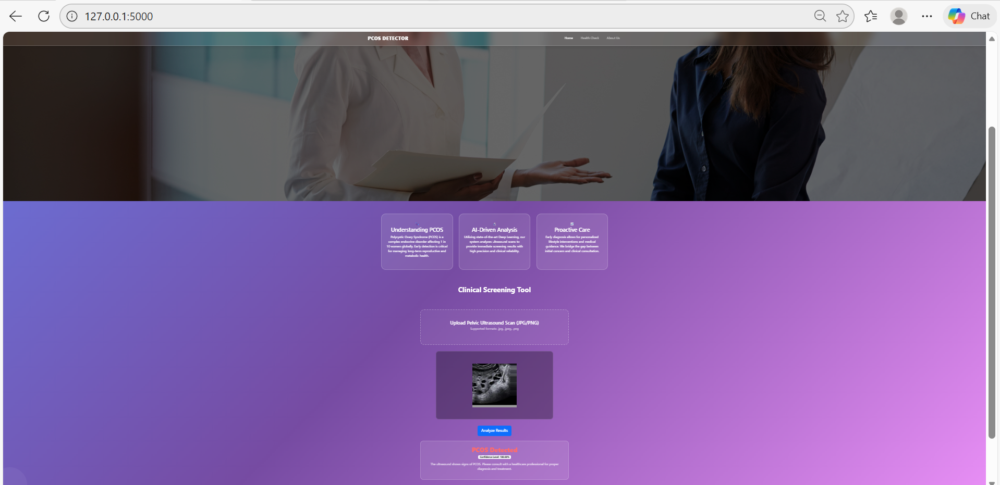
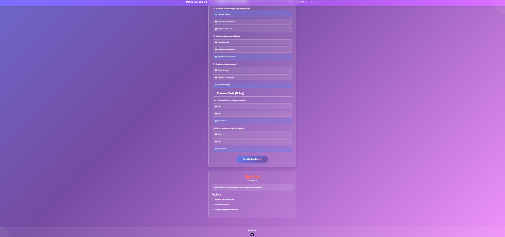
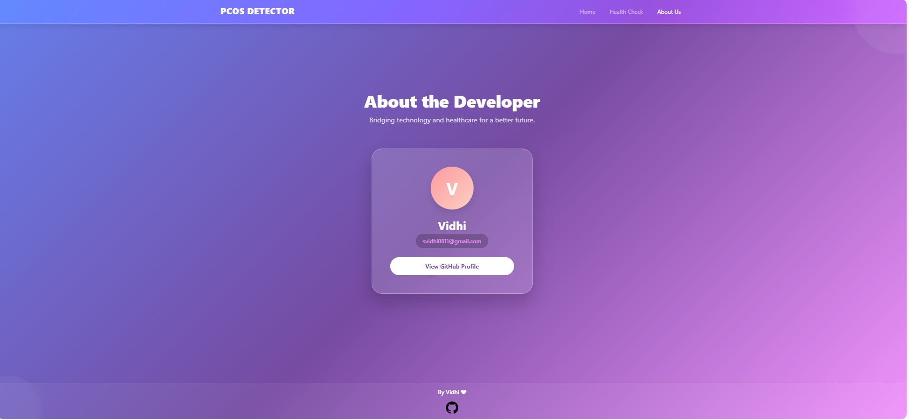

  <h1>🌸 PCOS Detector – Smart AI PCOS Screening</h1>
  
<strong>A web application that uses AI to check PCOS risk at an early stage.</strong>

<h2>📌 Project Overview</h2>

<strong>PCOS Detector</strong> helps in early PCOS risk checking using:

<ul>
  <li><strong>Ultrasound Image Analysis (Deep Learning)</strong></li>
  <li><strong>Health Questionnaire Analysis (Machine Learning)</strong></li>
</ul>

<h2>🔬 Ultrasound Image Model</h2>

<ul>
  <li><strong>Models Tested:</strong> Custom CNN, MobileNet</li>
  <li><strong>Final Model Selected:</strong> MobileNet (Transfer Learning)</li>
  <li><strong>Training Accuracy:</strong> ~94%</li>
  <li><strong>Validation Accuracy:</strong> ~91%</li>
  <li><strong>Image Size:</strong> 224x224</li>
</ul>

<h2>📋 Questionnaire Model</h2>

<ul>
  <li><strong>Models Compared:</strong> Logistic Regression, Random Forest, XGBoost, SVM</li>
  <li><strong>Final Model Selected:</strong> Calibrated SVM</li>
  <li><strong>Evaluation Metrics Used:</strong> Accuracy, Precision, Recall, F1 Score, ROC-AUC</li>
  <li><strong>Model Saved As:</strong> pcos_model.pkl</li>
</ul>

<h2>🚀 Main Features</h2>

<ul>
  <li>Shows percentage probability (example: 87%)</li>
  <li>Secure Image Upload (PNG/JPG only)</li>
  <li>Automatic Image Resize</li>
  <li>Works without refreshing page</li>
  <li>Responsive Glassmorphism UI</li>
</ul>

<h2>📸 Project Screenshots</h2>

<table align="center" border="1" cellpadding="6">
  <tr>
    <td align="center">
       
      <b>Home Page</b>
    </td>
    <td align="center">
       
      <b>Health Questionnaire</b>
    </td>
    <td align="center">
       
      <b>About Page</b>
    </td>
  </tr>
</table>

<h2>📖 How to Run</h2>

<ol>
  <li>Clone Repository:
    <pre>git clone https://github.com/your-username/your-repo-name.git</pre>
  </li>
  <li>Install Requirements:
    <pre>pip install -r requirements.txt</pre>
  </li>
  <li>Check Model Folder:
    <pre>
/model
 ├── bestmodel.h5
 ├── pcos_model.pkl
 └── preprocessor.pkl
    </pre>
  </li>
  <li>Run App:
    <pre>python app.py</pre>
  </li>
</ol>

<h2>⚠️ Disclaimer</h2>

This project is for learning and early screening only.
It does not replace a doctor's diagnosis.

  
<i>Developed by <b>Vidhi</b> 💜</i>

