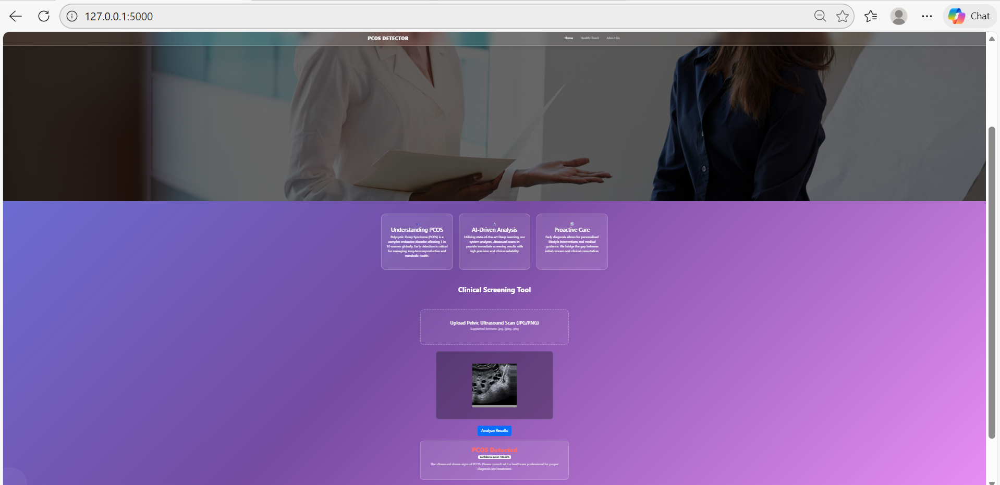
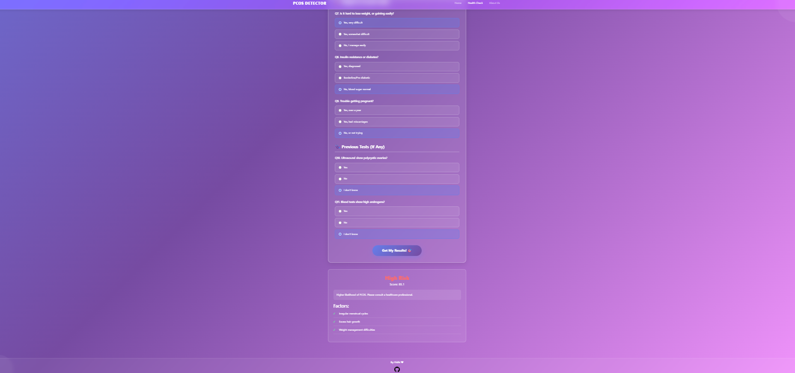
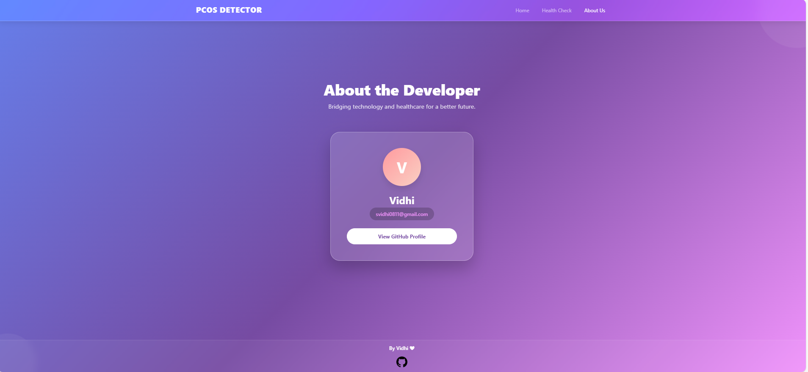

  <h1>🌸 PCOS Detector – Smart AI PCOS Screening</h1>
  
<strong>A web application that uses AI to check PCOS risk at an early stage.</strong>

<h2>📌 Project Overview</h2>

<strong>PCOS Detector</strong> helps in early PCOS risk assessment using:

<ul>
  <li><strong>Ultrasound Image Analysis (Deep Learning)</strong> – Detects PCOS from ovarian ultrasound images.</li>
  <li><strong>Health Questionnaire Analysis (Machine Learning)</strong> – Predicts PCOS risk from patient-provided health information.</li>
</ul>

<h2>🔬 Ultrasound Image Model</h2>
<ul>
  <li><strong>Models Tested:</strong> Custom CNN, MobileNet</li>
  <li><strong>Final Model Selected:</strong> MobileNet (Transfer Learning)</li>
  <li><strong>Training Accuracy:</strong> ~94%</li>
  <li><strong>Validation Accuracy:</strong> ~91%</li>
  <li><strong>Input Image Size:</strong> 224x224</li>
  <li><strong>Output:</strong> PCOS Detected / Not Detected with confidence percentage</li>
</ul>

<h2>📋 Health Questionnaire Model</h2>
<ul>
  <li><strong>Models Compared:</strong> Logistic Regression, Random Forest, XGBoost, SVM</li>
  <li><strong>Final Model Selected:</strong> Calibrated SVM</li>
  <li><strong>Evaluation Metrics:</strong> Accuracy, Precision, Recall, F1 Score, ROC-AUC</li>
  <li><strong>Model Files:</strong> pcos_model.pkl, preprocessor.pkl, imputer.pkl, model_metadata.pkl</li>
  <li><strong>Risk Score:</strong> Outputs a percentage (0–100%) with risk category (Low, Moderate, High)</li>
</ul>

<h2>🚀 Main Features</h2>
<ul>
  <li>AI-powered PCOS detection from ultrasound images</li>
  <li>Health questionnaire-based risk prediction with calibrated SVM</li>
  <li>Shows probability/confidence for each prediction</li>
  <li>Secure Image Upload (PNG/JPG only, max 16MB)</li>
  <li>Automatic image resizing to 224x224 pixels</li>
  <li>Responsive UI with Glassmorphism design</li>
  <li>Works without refreshing the page (AJAX)</li>
  <li>Identifies potential risk factors from questionnaire responses</li>
</ul>

<h2>📸 Project Screenshots</h2>
<table align="center" border="1" cellpadding="6">
  <tr>
    <td align="center">
       
      <b>Home Page</b>
    </td>
    <td align="center">
       
      <b>Health Questionnaire</b>
    </td>
    <td align="center">
       
      <b>About Page</b>
    </td>
  </tr>
</table>

<h2>📁 Repository Structure</h2>
<pre>
PCOS-Detector/
│
├── app.py                  # Main Flask app
├── requirements.txt        # Python dependencies
├── README.md               # Project documentation
├── model/                  # Trained model files
│   ├── bestmodel.h5        # Ultrasound image model
│   ├── pcos_model.pkl      # Calibrated SVM for questionnaire
│   ├── preprocessor.pkl    # Preprocessor for questionnaire
│   ├── imputer.pkl         # Gap-filler for missing inputs
│   └── model_metadata.pkl  # Best threshold and metadata
├── templates/              # HTML pages
│   ├── index.html
│   ├── detailcheck.html
│   ├── about.html
│   └── contact.html
├── static/                 # CSS, JS, images
│   └── images/             # Screenshots for README/UI
└── uploads/ (auto-generated)  # Temporary folder for uploaded images (do NOT commit)
</pre>

⚠️ <strong>Important:</strong> Do not commit <code>/uploads/</code> or large image datasets (<code>PCOS/</code> or <code>PCOS_split/</code>) to GitHub. The app will create the <code>uploads/</code> folder automatically.

<h2>📖 How to Run</h2>
<ol>
  <li>Clone Repository:
    <pre>git clone https://github.com/your-username/PCOS-Detector.git</pre>
  </li>
  <li>Install Dependencies:
    <pre>pip install -r requirements.txt</pre>
  </li>
  <li>Ensure Model Folder Exists:
    <pre>
/model
 ├── bestmodel.h5
 ├── pcos_model.pkl
 ├── preprocessor.pkl
 ├── imputer.pkl
 └── model_metadata.pkl
    </pre>
  </li>
  <li>Run Flask App:
    <pre>python app.py</pre>
  </li>
  <li>Open in Browser:
    <pre>http://127.0.0.1:5000/</pre>
  </li>
</ol>

<h2>⚠️ Disclaimer</h2>

This project is intended for learning and early screening purposes only. 
It does <strong>not replace professional medical advice or diagnosis</strong>. 
Always consult a healthcare provider for any health concerns.

  
<i>Developed by <b>Vidhi Singh</b> 💜</i>

